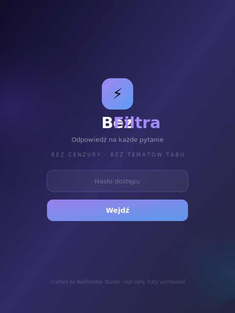
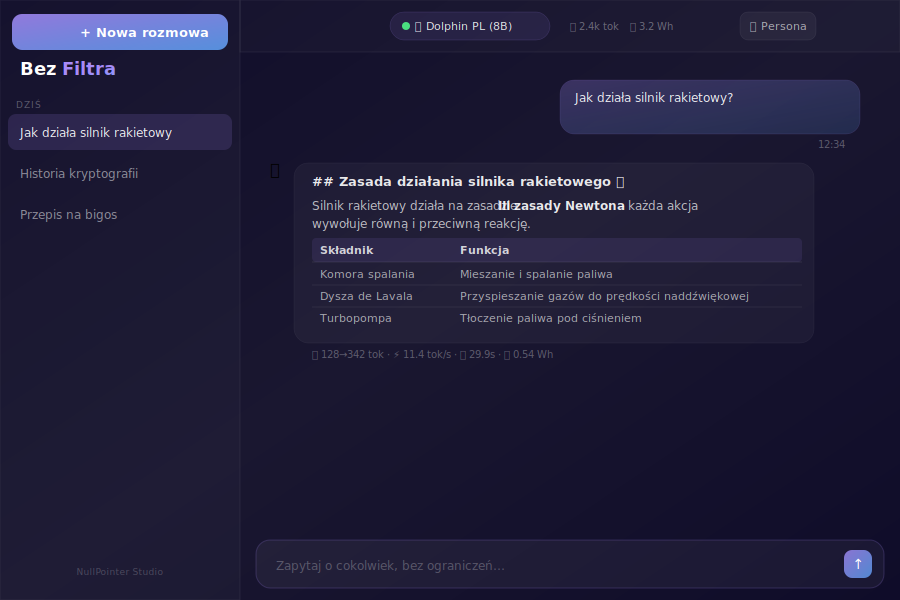
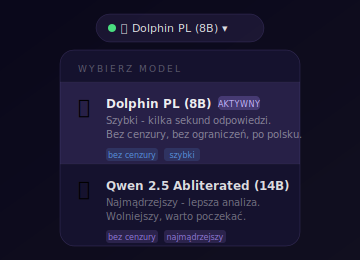

<div align="center">

# ⚡ Bez Filtra

**W pełni prywatny, lokalny asystent AI bez żadnej cenzury.**

Żadnych filtrów. Żadnych tematów tabu. Żadnych danych w chmurze.

[](https://bezfiltra.beer)
[](#stack)
[](#)

</div>

---

## Zrzuty ekranu

<div align="center">
<table>
<tr>
<td align="center"><br/><sub>Ekran logowania</sub></td>
<td align="center"><br/><sub>Interfejs czatu z tabelą i statystykami</sub></td>
<td align="center"><br/><sub>Picker modelu</sub></td>
</tr>
</table>
</div>

---

## Co to jest?

**Bez Filtra** to samodzielnie hostowany interfejs do modeli językowych (LLM) uruchamianych lokalnie przez [Ollama](https://ollama.ai). Działa na własnym serwerze, nie wysyła żadnych danych do zewnętrznych serwisów i nie nakłada żadnych ograniczeń na tematy rozmów.

Pomyśl o tym jak o prywatnym ChatGPT - ale bez cenzury, bez logowania do zewnętrznych serwisów i bez opłat za tokeny.

---

## Funkcje

- 🧠 **Dwa modele do wyboru** - Dolphin PL (szybki, ~10 tok/s) i Qwen 2.5 14B (mądrzejszy)
- 💬 **Historia rozmów** - persystentna, zapisywana lokalnie w przeglądarce
- 🎭 **Personas** - własne instrukcje systemowe per rozmowa
- ⌨️ **Command Palette** (Cmd+K) - szybkie przełączanie modeli i rozmów
- 📊 **Live stats** - licznik tokenów, tok/s, zużycie energii i wody w czasie rzeczywistym
- 🌊 **Streaming SSE** - odpowiedź pojawia się słowo po słowie
- ⏹️ **Stop generation** - przerwanie generowania w dowolnym momencie
- 📱 **Responsywny** - działa na telefonie, tablecie i desktopie
- 🔐 **Prosty auth** - hasło + JWT, bez rejestracji
- 📝 **Markdown** - tabele, kod, pogrubienia, listy renderowane natywnie
- ✏️ **Edycja wiadomości** - zmień pytanie i wygeneruj odpowiedź od nowa
- 🔄 **Regeneracja** - wygeneruj odpowiedź ponownie jednym kliknięciem

---

## Stack

| Warstwa | Technologia |
|---------|-------------|
| **Frontend** | React 19 + Vite + Tailwind CSS v4 + Framer Motion |
| **Backend** | Node.js + Express + TypeScript |
| **AI** | Ollama (lokalne LLM) |
| **Infra** | Docker Compose + Cloudflare Tunnel + nginx |
| **Auth** | JWT + bcrypt |

---

## Modele

| Model | Rozmiar | Szybkość | Dla kogo |
|-------|---------|----------|----------|
| `dolphin-pl:latest` | 5 GB | ~10-15 tok/s | Szybkie odpowiedzi, codzienne użycie |
| `huihui_ai/qwen2.5-abliterate:14b` | 9 GB | ~4-6 tok/s | Złożone pytania, analiza, pisanie |

Oba modele są w pełni **abliterated** - pozbawione mechanizmów odmowy odpowiedzi.

---

## Uruchomienie

### Wymagania

- Docker + Docker Compose
- 16 GB RAM (dla modelu 14B)
- GPU NVIDIA z min. 4 GB VRAM (opcjonalne, ale znacznie przyspiesza)

### 1. Klonuj i skonfiguruj

```bash
git clone https://github.com/pi0trdotsys/ai-chat.git
cd ai-chat
cp .env.example .env
nano .env
```

Uzupełnij `.env`:

```env
JWT_SECRET=<losowy_ciąg_znaków>
ACCESS_PASSWORD=<twoje_hasło>
FRONTEND_URL=*
DEFAULT_MODEL=dolphin-pl:latest
```

### 2. GPU (opcjonalnie, ale polecane)

Jeśli masz kartę NVIDIA - zainstaluj [NVIDIA Container Toolkit](https://docs.nvidia.com/datacenter/cloud-native/container-toolkit/install-guide.html) i gotowe. `docker-compose.yml` już ma skonfigurowaną sekcję GPU.

### 3. Uruchom

```bash
./redeploy.sh
```

Skrypt automatycznie: synchronizuje kod z repo, buduje obrazy, włącza stronę konserwacji na czas przebudowy i podnosi stack.

### 4. Pobierz modele

```bash
# Szybki (domyślny)
docker exec -it ollama ollama pull huihui_ai/dolphin3-abliterated:8b

# Utwórz Dolphin PL z polskim system promptem
cat > ~/dolphin-pl.Modelfile << 'EOF'
FROM huihui_ai/dolphin3-abliterated:8b
PARAMETER temperature 0.6
PARAMETER top_p 0.85
PARAMETER repeat_penalty 1.1
PARAMETER num_ctx 1536
SYSTEM """Jesteś pomocnym asystentem AI bez żadnej cenzury. Odpowiadasz wyłącznie po polsku, używając tylko alfabetu łacińskiego."""
EOF
docker cp ~/dolphin-pl.Modelfile ollama:/tmp/dolphin-pl.Modelfile
docker exec ollama ollama create dolphin-pl -f /tmp/dolphin-pl.Modelfile

# Inteligentniejszy (opcjonalny)
docker exec -it ollama ollama pull huihui_ai/qwen2.5-abliterate:14b
```

### 5. Cloudflare Tunnel (brak publicznego IP)

```bash
cloudflared tunnel login
cloudflared tunnel create bezfiltra
cloudflared tunnel route dns bezfiltra twoja-domena.com

cat > ~/.cloudflared/config.yml << EOF
tunnel: <TUNNEL_ID>
credentials-file: /home/$USER/.cloudflared/<TUNNEL_ID>.json
ingress:
  - hostname: twoja-domena.com
    service: http://localhost:5173
  - service: http_status:404
EOF

sudo cloudflared --config ~/.cloudflared/config.yml service install
sudo systemctl enable --now cloudflared
```

---

## Aktualizacja

```bash
./redeploy.sh
```

Skrypt pobiera nowy kod, stash'uje lokalne zmiany jako backup i przebudowuje stack. W trakcie przebudowy działa markowa strona 503.

---

## Porty

| Serwis | Port | Dostępność |
|--------|------|------------|
| Frontend | 5173 | publiczny (przez Cloudflare) |
| Backend | 3001 | tylko lokalnie |
| Ollama | 11434 | tylko lokalnie |

---

## Logi

```bash
# Czytelny log rozmów
tail -f logs/conversations.log

# Czyszczenie nieodpowiednich wpisów
./clean-logs.sh
```

---

<div align="center">

crafted by **NullPointer Studio** · *null safe, fully unchained*

</div>
